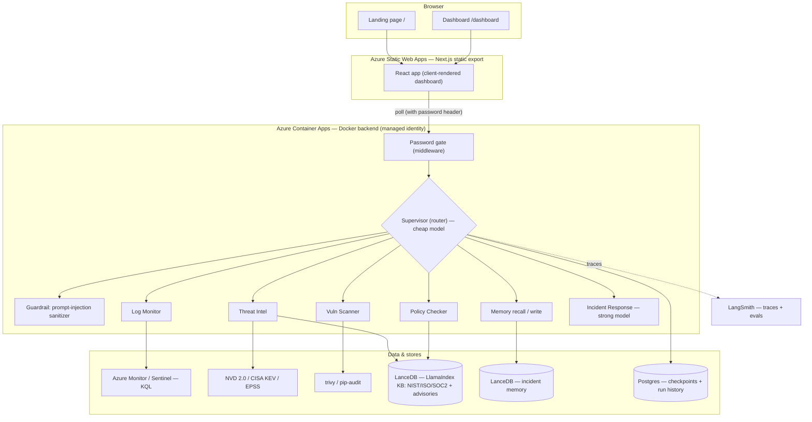
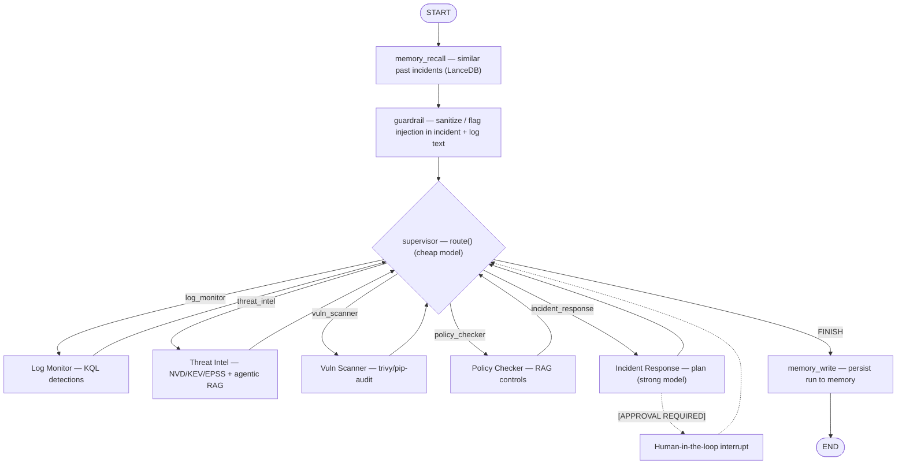
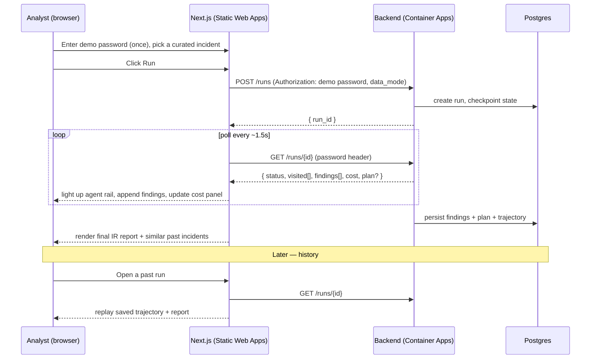
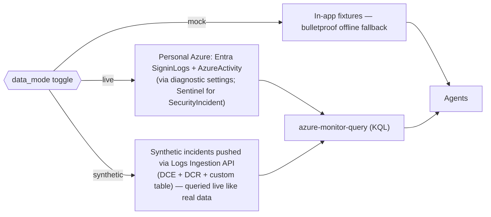
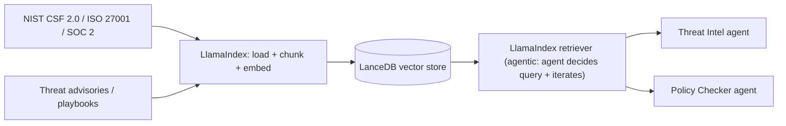
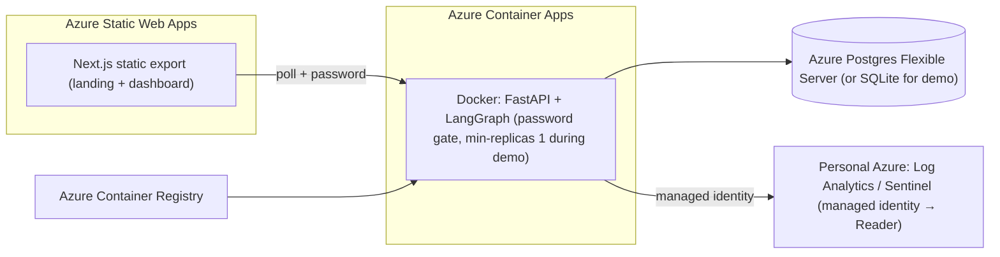

# SecOps Multi-Agent — Capstone Build Plan

A multi-agent cybersecurity system: five specialist agents coordinated by a
supervisor, fed by **Azure Monitor / Microsoft Sentinel** logs, grounded with
**agentic RAG**, and gated by an **evaluation harness**. Front end is
**Next.js + shadcn/ui** (landing page + live dashboard). Built for a graded
capstone, so this plan also maps each piece to the program theme it demonstrates.

> Scope note: this is a presenter-driven **demo** on a public-but-unshared
> Azure URL, gated by a per-demo password. **MCP + coding agents are out of
> scope** for this demo (deliberate, to keep it focused).

---

## 1. Goals

- Showcase the in-demand, evaluated themes: **agentic AI / multi-agent
  orchestration, agentic RAG, evaluation, deployment, cost optimization,
  safety (prompt-injection defense), and memory.**
- Five agents: Log Monitor, Threat Intelligence, Vulnerability Scanner, Policy
  Checker, Incident Response — plus a guardrail layer and long-term memory.
- Dashboard shows agent activity **live (polling) and historically**.
- Data is **toggleable**: live Azure telemetry / synthetic-ingested / mock.
- No login; per-demo password at the backend; spend cap; torn down after.

## 2. Tech stack

| Layer | Choice | Why |
|---|---|---|
| Orchestration | LangGraph (supervisor pattern) + LangChain | Stateful, checkpointed, auditable multi-agent graphs |
| LLM | `init_chat_model`, **two tiers** (cheap triage + strong synthesis) | Cost optimization, provider-swappable |
| Logs (primary) | Azure Monitor / Sentinel via `azure-monitor-query` (KQL) | First-class SDK; Container App **managed identity** → Log Analytics Reader |
| Threat intel | NVD 2.0 + CISA KEV + FIRST EPSS | Layered prioritization (CVSS alone insufficient) |
| Scanning | trivy, pip-audit (subprocess) | Standard OSS scanners |
| RAG | **LlamaIndex + LanceDB** (compliance + threat KB) | Program-taught stack; agentic, iterative retrieval |
| Safety | Prompt-injection guardrail on ingested text (OWASP LLM06) | A SOC tool ingests attacker-controlled log text |
| Memory | Long-term incident store (LanceDB table / LangGraph store) | Recall similar past incidents on new ones |
| State / persistence | Postgres (Azure Flexible Server) via `langgraph-checkpoint-postgres`; SQLite OK for demo | Resumable runs + run history |
| Backend API | FastAPI; **polling** progress endpoints | Robust on static-frontend + container; no SSE fragility |
| Frontend | Next.js 16 (App Router, **static export**) + React 19 + Tailwind v4 + shadcn/ui | Landing-page polish; own your components |
| Charts | Recharts | shadcn-friendly dashboards + cost panel |
| Eval | LangSmith + AgentEvals + pytest | Deterministic + LLM-judge + trajectory; CI gate |
| Deploy | **Azure Static Web Apps** (frontend) + **Azure Container Apps** (Docker backend) | All-Azure; managed identity; scale-to-zero |

## 3. Capstone theme → feature map

| Program theme | Where it shows up in the demo |
|---|---|
| Agentic AI / multi-agent orchestration | LangGraph supervisor routing 5 specialists |
| LangGraph | The graph itself (state, routing, checkpointing, interrupt) |
| LangChain | Tools, `init_chat_model`, agent construction |
| LangSmith | Trajectory tracing + the eval harness |
| Evaluation (Codex + Evals) | Deterministic + LLM-judge + trajectory evaluators, CI gate |
| RAG / LanceDB / LlamaIndex / "Atlas" | LlamaIndex retrieval over a LanceDB compliance + threat KB |
| Agentic RAG | Agent decides what to retrieve and iterates toward an answer |
| Prompt engineering | Structured agent prompts + the guardrail |
| Cost optimization | Two-tier model routing + prompt caching + live cost panel |
| Deployment | Azure Static Web Apps + Container Apps |
| Safety / guardrails | Prompt-injection defense on ingested logs |
| Memory | Long-term incident recall |
| _MCP / coding agents_ | _Deliberately out of scope for this demo_ |
| _n8n, Gradio, local models, intro builds_ | _Out — not "hardcore application" material here_ |

## 4. System architecture



## 5. LangGraph flow

Supervisor (router) pattern, bounded by a hard step ceiling. Untrusted text
(log rows, CVE descriptions) passes through the **guardrail** before reaching
the LLM. **Memory** is read at the start (similar past incidents) and written at
the end. The supervisor and triage run on a **cheap model**; the Incident
Response synthesis uses a **strong model** (cost tiering).



Shared state (Pydantic, `Literal` routing, `add_messages` reducer):
`messages`, `incident`, `findings[]`, `cve_matches[]`, `similar_past[]`,
`guardrail_flags[]`, `cost{}`, `next_agent`, `visited[]`, `step`, `response_plan`.

## 6. Live-run sequence (polling + history)



## 7. Data sources & RAG

### Three toggleable data modes

Auth to Azure uses the Container App's **system-assigned managed identity**
granted **Log Analytics Reader** — no secret in the container. `live` falls back
to `mock` automatically if a query fails, so a demo never dies on stage.

### RAG ingestion (LlamaIndex + LanceDB)


## 8. New showcase features (how each works)

- **Cost optimization.** Two model tiers via `init_chat_model`: a cheap/fast
  model for the supervisor + triage agents, a strong model only for the IR-plan
  synthesis. Enable prompt caching on the system prompts. Track token usage per
  node into `state.cost` and surface it in a dashboard **cost panel** (per-run
  $ + per-agent breakdown). Demo line: "same result, a fraction of the spend."
- **Prompt-injection guardrail (OWASP LLM06).** Log rows and CVE text are
  attacker-influenced. Before that text enters the LLM context, run a guardrail:
  pattern + LLM-classifier check for injection ("ignore previous instructions",
  tool-coercion, exfil prompts); suspicious content is quarantined/escaped and
  surfaced as a `guardrail_flag` finding rather than executed. Demo line: plant
  an injected log line and show the system flagging instead of obeying it.
- **Long-term memory.** Completed runs (incident → findings → resolution) are
  embedded into a LanceDB memory table. On a new incident, `memory_recall`
  retrieves the top-k similar past incidents to prime the agents and show the
  analyst "we've seen this before." Demo line: run a similar incident twice;
  the second run cites the first.

## 9. UI specification (no login; password prompt once)

### Landing `/`
Hero + value prop + "Open dashboard" CTA; "How it works" (5 agents); condensed
architecture + LangGraph flow; feature strip (Azure-native, agentic RAG,
eval-gated, cost-aware, injection-safe). Static — no auth.

### Dashboard `/dashboard`
| Route | View | Notable pieces |
|---|---|---|
| `/dashboard` | KPIs: open incidents, critical KEV CVEs, compliance %, recent runs, **spend** | `card`, recharts, `badge` |
| `/dashboard/run` | Data-mode toggle, curated incident picker, agent rail (polling), findings feed, streaming-feel plan, **cost panel**, **similar-incidents panel**, **guardrail flags** | `progress`, `scroll-area`, `sonner`, `resizable` |
| `/dashboard/threats` | CVE table: CVSS/EPSS/KEV/ransomware/priority | `table`, `command` |
| `/dashboard/compliance` | Control coverage per framework + gaps | `tabs`, `chart` |
| `/dashboard/history` | Past runs + detail replay | `table`, `sheet` |

A one-time password modal on first load stores the value for the session.

## 10. API contract

All endpoints require the demo password header. Polling, not SSE.

| Method | Path | Purpose |
|---|---|---|
| POST | `/runs` | Start run `{incident_id, data_mode}` → `{run_id}` |
| GET | `/runs/{id}` | Poll: `{status, visited[], findings[], cve_matches[], cost, guardrail_flags[], similar_past[], plan?}` |
| GET | `/runs` | History list |
| POST | `/runs/{id}/approve` | Resume an interrupted (HITL) run |
| GET | `/threats` | CVE table rows (priority-scored) |
| GET | `/compliance` | Control posture by framework |
| GET | `/incidents` | Curated incident list (bounds cost) |

## 11. Repo layout (monorepo)

```
secops/
  apps/web/                   # Next.js static export → Azure Static Web Apps
    app/(marketing)/page.tsx          # landing
    app/dashboard/...                 # overview/run/threats/compliance/history
    components/ui/                    # shadcn (owned)
    lib/api.ts                        # fetch + polling + password header
  backend/                    # FastAPI + LangGraph → Azure Container Apps
    secops/
      config.py state.py llm.py graph.py agents.py
      guardrail.py memory.py cost.py
      tools/{azure_logs,threat_intel,scanner}.py
      rag/index.py                    # LlamaIndex + LanceDB
      server.py                       # FastAPI: password mw + polling endpoints
    Dockerfile
  packages/shared/            # shared TS/py types (finding, cve, run)
  evals/                      # golden.jsonl, evaluators.py, test_agents.py
  .github/workflows/eval.yml  # CI eval gate
  infra/                      # bicep/terraform: SWA, ACA, ACR, Postgres, DCR/DCE
  docker-compose.yml          # local: backend + postgres
```

## 12. Deployment architecture (all-Azure)



Guardrails for the public-but-unshared URL: **per-demo password** at the
backend, **spend cap + alert** on the LLM key and subscription, **curated
incidents only**, **min-replicas → 0 / delete after the demo**.

## 13. Evaluation plan

- Golden dataset in git (`evals/datasets/golden.jsonl`).
- Mix ~60% deterministic (severity floor, keyword coverage, plan-present,
  agent-coverage/trajectory) + ~30% LLM-judge (plan actionable/ordered/grounded)
  + ~10% human.
- New, theme-specific evaluators: **guardrail catch-rate** (injected samples
  flagged, not obeyed), **memory-recall relevance** (did it surface the right
  past incident), **cost regression** (tokens/$ per run under a ceiling).
- pytest + LangSmith; CI gate fails the build on regression vs baseline.

## 14. Build sequence for Claude Code

| Phase | Deliverable |
|---|---|
| 0 | Monorepo scaffold + envs + docker-compose + infra stubs |
| 1 | LangGraph supervisor + 5 agents, Pydantic state, step ceiling, mock mode |
| 2 | Tools: azure_logs (KQL lib), threat_intel (NVD/KEV/EPSS), scanner |
| 3 | RAG: LlamaIndex + LanceDB index + agentic retriever |
| 4 | Guardrail layer + memory (recall/write) + cost accounting + model tiering |
| 5 | FastAPI: password middleware + polling endpoints + curated incidents |
| 6 | Frontend: landing page (static) |
| 7 | Dashboard shell + routing + shadcn + recharts (mock data) |
| 8 | Wire polling: agent rail, findings feed, cost panel, similar-incidents, flags |
| 9 | History / threats / compliance views |
| 10 | HITL interrupt + /approve |
| 11 | Evals (incl. guardrail/memory/cost) + CI gate |
| 12 | Azure data: diagnostic settings (live) + Logs Ingestion API (synthetic) |
| 13 | Deploy: SWA + ACA + ACR + Postgres; managed identity; spend cap |

## 15. Open decisions & risks

- **State store for the demo:** Azure Postgres Flexible Server (persistent
  history) vs SQLite in-container (simplest, ephemeral). SQLite is fine if you
  don't need history to survive a redeploy.
- **Guardrail strictness:** too strict blocks benign logs; tune on the golden
  set and keep a visible "flagged, not blocked" path so the demo still flows.
- **Live data volume:** a fresh personal workspace may be sparse — lean on the
  synthetic-ingested mode to guarantee rich, predictable incidents on stage.
- **Cost during demo:** even gated, keep the spend cap; agent runs are the
  expensive part.
- **MCP/coding agents excluded:** intentional for scope; note it in your
  capstone writeup so evaluators see it was a decision, not a gap.
